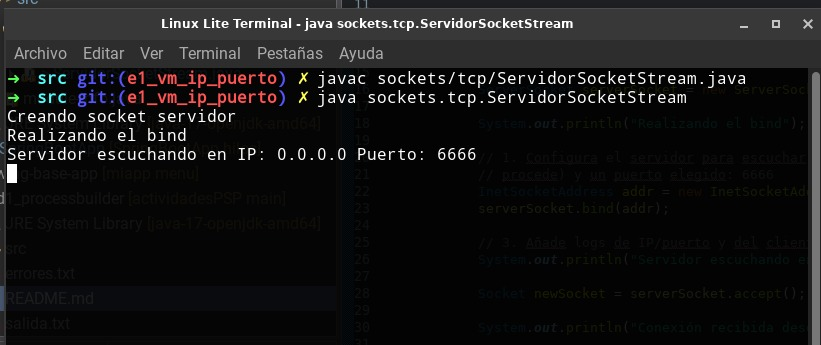
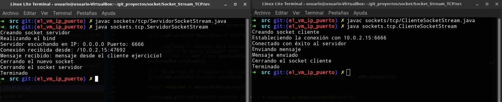

<h1>EJERCICIO 1</h1>
La IP de la VM la obtuve con el comando <b>hostname -I</b>, ya que trabajo desde Linux.
  

<b>- IP del Servidor:</b> Configurada para escuchar en 0.0.0.0.
 
<b>- IP del Cliente:</b> IP de la VM (ej: 10.0.2.15).
 
<b>- Puerto:</b> Seleccionado manualmente (6666).
  

<h3>Cómo ejecutar:</h3>
Desde la carpeta Socket_Stream_TCP/src ejecuta en la terminal: 
  
- javac sockets/tcp/ServidorSocketStream.java (Compila .java del servidor)
 
- java sockets.tcp.ServidorSocketStream (Ejecuta el .java)
  
 
  
En otra terminal ejecuta, desde la misma ruta anterior:
  
- javac sockets/tcp/ClienteSocketStream.java (Compila .java del cliente)
 
- java sockets.tcp.ClienteSocketStream (Ejecuta el .java)
  
 